# Почему это важно

Если честно, в начале своего пути я не сильно интересовался юнит-тестированием, как и тестированием в целом. Да, вроде классно, когда есть какой-нибудь CI/CD-пайплайн с кучей тестов, благодаря которому ты сразу можешь понять, что и где отвалилось при сборке нового билда после внесения изменений в код. Но писать тесты поверх фич было большим оверхедом, так как на большинстве казуальных проектов, над которыми я работал и работаю, достаточно тестов в Play Mode, чтобы понять, что всё работает как надо (здесь под тестами я подразумеваю, что можно просто зайти в игру и потыкать ручками в новые кнопки). Однако всё изменилось с приходом ИИ.

Если вам интересно моё мнение: не пользоваться ИИ в современной разработке — глупо. Но также стоит добавить: использовать ИИ в современной разработке и не ограничивать работу этого самого ИИ тестами — глупо вдвойне.

Я пользуюсь агентами в разработке уже почти год и только недавно завёл себе правило: в начале работы с новым агентом или новой моделью всегда ставить одно и то же условие — при добавлении кода или изменении кодовой базы проекта писать новые или обновлять существующие тесты. В рамках Unity, как правило, ИИ автоматически выбирает стандартный API библиотеки NUnit, если не указано иное или если в фиче явно не нужен yield-синтаксис.

Нагляднее всего польза от тестов прослеживается в процессе работы с ИИ.
Зачастую это выглядит так:
- вы говорите нейронке, чего хотите, и просите составить план реализации;
- валидируете план и либо одобряете его, либо вносите изменения;
- смотрите финальный результат;
- вам может повезти (вы гений промпт-инжиниринга), и нейросеть справится с поставленной задачей на все 100 процентов;
- вам может не повезти (вы не гений промпт-инжиниринга), и вы начинаете итерировать с нейронкой в надежде, что вот сейчас-то она вас точно поймёт.

Если вы добавите тесты после валидации и перед просмотром финального результата, то, по сути, скажете нейронке: «Если твоё решение не проходит тесты — переделывай». Это заставляет нейронку итерировать без вашего участия.

Мне кажется, это единственный верный способ использовать ИИ в разработке и действительно экономить время.

Стоит, конечно, опасаться ситуаций, когда нейронка сначала пишет фичу, а потом — тесты, очевидно подгоняя их под свою реализацию. Лучше сначала потратить время на написание тестов, в которых будет прописано, как должна работать та или иная фича, чем потом убеждать нейронку, что она вас газлайтит.

Давайте также обозначим основные преимущества и недостатки тестирования в любых проектах (не только в играх), так как сам по себе процесс достаточно трудозатратный и решение о внедрении тестирования должно приниматься осторожно.

Преимущества:
- быстрый детект багов и, как следствие, меньшее их количество;
- тест = документ. При внедрении сторонней библиотеки или банальном создании новой фичи у вас есть наглядные условия и правила, по которым должны работать остальные части кода даже после внесения изменений в проект. Так вы точно будете уверены, что та самая библиотека или фича ничего не сломала. Это же будет относиться и к рефакторингу, после которого вы сможете проверить, что логика всех затронутых им модулей работает согласно тестам;
- более чистый код. Хотя я и не советую выносить дополнительные проверки из кода (например, проверку на null), вы вполне можете переложить всё это на тесты.

Недостатки:
- общая стоимость поддержки такой системы. Помимо дисциплины, которая нужна вам для осознания того, что раз уж вы внедрили тестирование в проект, то и любой новый код должен содержать соответствующие тесты, стоит учитывать, что на поддержание всей системы нужно время: тесты необходимо не только создавать, но и поддерживать в актуальном состоянии;
- фейковая уверенность. Помните, что вы пишете тесты, в которых описываете определённые условия, однако не всегда можете учесть и предугадать все ситуации, с которыми приложение столкнётся во время работы.

Существует также целая методология разработки, основой которой являются тесты, — TDD, или Test-Driven Development. Её суть в том, что вы изначально пишете тесты, в которых описываете логику приложения, а только затем — код для прохождения тестов.

Напоследок ещё раз повторю сказанное в начале: тестирование может быть оверхедом для некоторых проектов (особенно небольших).

Если же вам всё ещё интересно, что такое Unit-тесты и как их писать в Unity, давайте сначала разберёмся с определениями.

# Что такое Unit Test

`Unit Test` — тест, предназначенный для тестирования отдельного юнита кода (фичи, метода и т. д.). Юнит-тесты создаются для проверки небольшого участка логики в конкретном сценарии при заданных условиях. Мы проверяем, выполняется ли эта логика так, как мы задумали.

>Юнит-тесты принудительно выполняют логику метода.

Главная ценность таких тестов — возможность проверить исправность того или иного модуля после его обновления или обновления связанного с ним модуля.

# Комплекс юнит-тестов

Также существует понятие комплекса юнит-тестов. Это класс или метод, содержащий все юнит-тесты, которые относятся к определённой логической группе.

Суть комплекса в том, что, если хотя бы один из тестов не проходит проверку, весь комплекс также не проходит её.

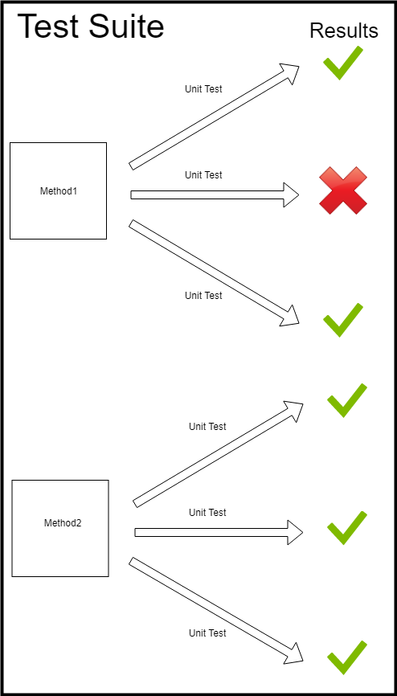

*Спасибо [PatientZero](https://habr.com/ru/users/PatientZero/) за такую простую, но полезную иллюстрацию, а также за его хорошую статью по юнит-тестированию.*

# Unity Test Framework (UTF)

`Unity Test Framework` — пакет Unity для написания тестов. Он использует и расширяет библиотеку NUnit для .NET. В Unity эти расширения дают возможность взаимодействовать с концепциями движка (пропускать кадры, перезагружать домен и т. д.).

Стоит также отметить, что тестирование того или иного модуля возможно, только если он изолирован от других своим asmdef-файлом. Чтобы протестировать код в конкретном asmdef-файле, этот файл должен содержать ссылку на DLL библиотеки NUnit, то есть assembly reference, а не asmdef reference (пример будет показан ниже).

В заключение хочется сказать, что, по сути, UTF — это просто название пакета и более полное наименование всего инструментария, который есть в Unity для написания своих тестов. Рабочей лошадкой же является Unity Test Runner.

# Unity Test Runner

_Window ▸ General ▸ Test Runner_.

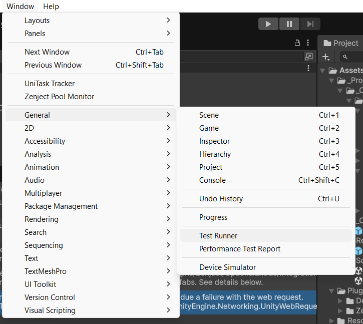


`Unity Test Runner` — инструмент, позволяющий запускать определённые тесты и проверять их результаты.

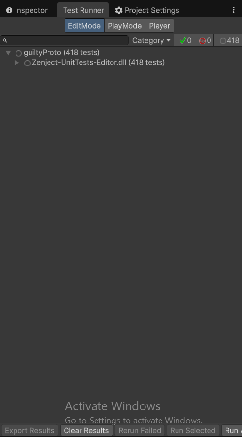

*Пример сборки внутри пакета Zenject, где по умолчанию есть DLL с тестами, которые мы также можем проверить в окне Test Runner.*

В этом окне мы будем видеть тесты для разных режимов и результаты их запуска.

Глобально тесты можно разделить на те, что запускаются в Edit Mode и в Player Mode.

Однако прежде чем поговорить про каждый из них отдельно, нужно выделить их общие стороны:

- у теста должен быть свой asmdef-файл с референсом на `nunit.framework.dll`;

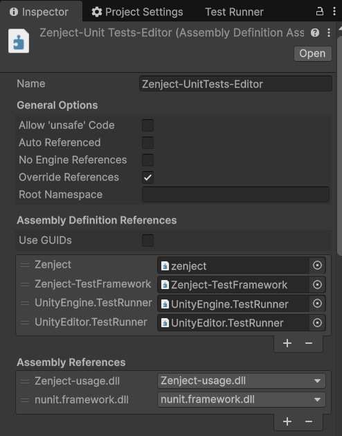

- в asmdef-файле таких тестов нам также нужно указывать целевую платформу или платформы: Editor — для тестов только в редакторе.

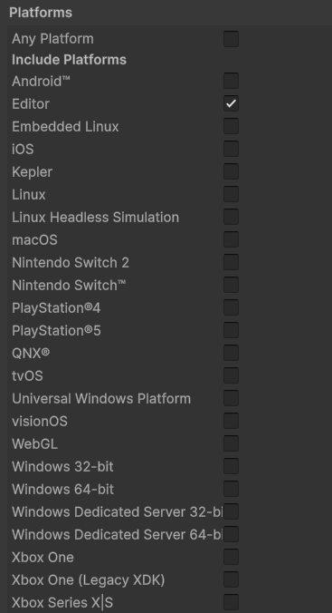

>Asmdef-файл с тестами не может содержать ссылку на предопределённую Assembly-CSharp.dll, в которую компилируются все скрипты по умолчанию.

## Editor-тесты

Они запускаются только в Editor, имеют доступ к редактору и коду в рантайме, а также к пространствам имён UnityEngine и UnityEditor.

Для их написания мы используем атрибут `UnityTest`, а работают они на колбэке EditorApplication.update, а не на корутине.

>Сам EditorApplication.update не привязан к циклу Update в Play Mode. Вместо этого он работает на основе тиков редактора, которые непостоянны и зависят от конкретных условий. Обычно редактор старается ориентироваться на значение `ApplicationIdleTime`, которое записывается в [[EditorPrefs]] и используется как интервал между тиками в редакторе. Значение по умолчанию — 4 секунды. Некоторые операции (запуск в фоновом режиме, перетаскивание и пр.) могут повлиять на частоту тиков.

В этой статье мы будем писать только Play Mode-тесты, так как Editor-тесты вы, скорее всего, будете писать, когда захотите проверить логику какого-нибудь постпроцесса, самописной утилиты для движка и пр. Для самой игры они, безусловно, тоже могут быть полезны.

## Player-тесты

Они позволяют тестировать код приложения в рантайме через корутину и атрибут `UnityTest`. Условия для написания таких тестов:

- у них, так же, как и у Editor-тестов, должен быть свой asmdef-файл с референсом на `nunit.framework.dll`;
- скрипты тестов должны быть в той же папке, что и asmdef-файл;
- тестовый asmdef-файл должен содержать ссылку на дополнительный asmdef-файл, код которого мы будем тестировать.

## UnityTest vs Test

Главным маркером, который будет определять ту или иную часть кода как тест, является соответствующий атрибут. В рамках этой статьи будут рассматриваться самые популярные решения — вышеупомянутые NUnit и UTF (Unity Test Framework).

Мы можем использовать атрибут из библиотеки NUnit `Test` вместо `UnityTest` для обоих видов тестов в случаях, когда нам не нужно:
- использовать yield-инструкции для Editor-тестов;
- делать yield чего-либо (кадров, секунд, событий движка и пр.) в Play-тестах.

>Может, это стоило сказать ранее, но Unity вообще не заставляет вас писать тесты через собственную обёртку над библиотекой NUnit. Вы можете пользоваться исключительно API библиотеки, и всё будет работать точно так же. Однако, если вам нужно контролировать какие-то фичи внутри жизненного цикла движка, используйте синтаксис Unity и UTF (Unity Test Framework). Более подробно: https://docs.unity3d.com/Packages/com.unity.test-framework@2.0/manual/index.html

# Небольшое резюме по введению

Итак, мы уже поняли, что:
- тесты — это здорово! Особенно при работе с ИИ;
- любой тест представляет собой принудительно выполняемый метод или совокупность методов;
- у теста есть чёткие условия, когда он считается выполненным, а когда нет;
- Unity использует в качестве основы библиотеку NUnit, а также дополнение к ней в лице UTF (Unity Test Framework). Помните, что для написания тестов вы можете использовать и то и другое — да хоть всё сразу;
- тест выделяется определённым синтаксисом: в случае с Unity и C# это атрибуты.

Теперь, когда мы разобрались с базой, осталось понять, как же писать тесты самостоятельно.
# Пишем свой первый тест

Как мы уже поняли, тест — это метод внутри класса с особым атрибутом. Test Runner просто обходит все классы в папке с asmdef-файлом и принудительно выполняет их методы.

В Unity мы можем быстро создать папку с тестами в иерархии проекта через контекстное меню.

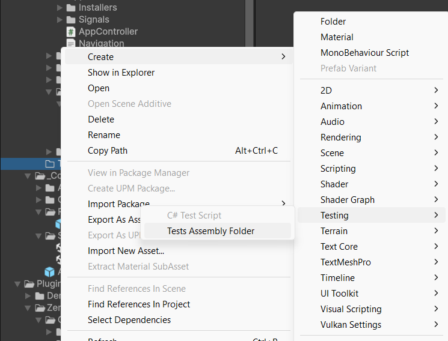

Тут автоматически будут добавлены все нужные ссылки.

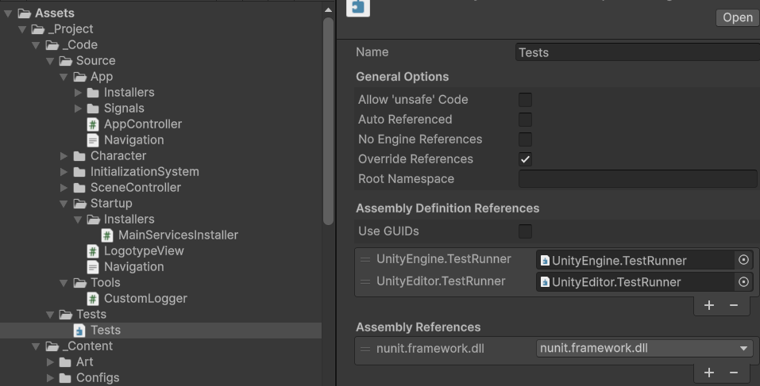

>Такое разделение позволяет Unity, да и нам как разработчикам, отделять исходный код от кода с тестами.

Далее, чтобы наша сборка с тестами могла обращаться к типам самой игры, мы должны создать asmdef-файл в папке, код и логику которой хотим протестировать, а затем добавить ссылку на него в asmdef-файл сборки в папке тестов.

В этой статье мы будем писать тесты для самописного контроллера персонажа, в котором есть функционал двойного прыжка, приседания и дэша. Как раз все эти фичи нам предстоит покрыть тестами.
Дабы не вставлять сюда сотни строк кода, ограничимся только теми методами и значениями, которые будем тестировать.

Сигнатура теста:

```c#
    public sealed class CharacterControllerTest  
    {  
        private const float SpawnY = 1f;  
        private const float FallingVelocityBeforeSecondJump = -3f;  
  
        private GameObject _ground;  
        private GameObject _player;
          
        private Rigidbody2D _body;  
        private CharacterConfig _config;  
        private CharacterInputFake _input;
```

Сам класс с тестами не является тестом, поэтому не содержит никаких атрибутов.

## Пара слов про DI в тестах

>К примеру, у Zenject есть собственные обёртки для тестирования, которые упрощают процесс создания тестов с использованием концепции DI. Ниже будет приведена лишь базовая информация о юнит-тестах, хотя возможности фреймворка ими не ограничиваются.
>
>Стоит добавить, что тут я не буду рассказывать о дополнительных атрибутах, типах и пр., так как считаю, что они лишь усложняют использование DI при юнит-тестировании путём создания под капотом новых контекстов и контейнеров. Куда проще создать контейнер прямо в тесте и биндить или резолвить всё, что душе угодно.
>
>Однако для интеграционных тестов (тестов не отдельных юнитов или модулей, а целых систем, в которых эти самые модули взаимодействуют как внутри, так и вовне) у Zenject есть достаточно полезные инструменты.
>
>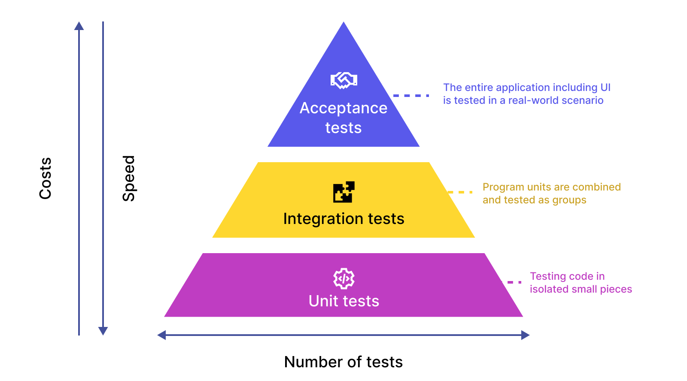
>
>Если хотите почитать подробнее, вот ссылка на документацию из их репозитория: https://github.com/modesttree/Zenject/blob/master/Documentation/WritingAutomatedTests.md. В данной статье речь пойдёт только про Zenject; для любых других DI-фреймворков смотрите их официальную документацию.

На самом деле, с DI в тестах всё просто: создаёте контейнер — и всё готово. Вам не нужно регистрировать сам тест в инсталлерах или их аналогах.

Зависимости можно резолвить через метод контейнера `Resolve()` либо через атрибут `[Inject]`.

```c#
[UnitySetUp]  
public IEnumerator UnitySetUp()  
{  
    _config = ScriptableObject.CreateInstance<CharacterConfig>();  
    _input = new CharacterInputFake();  
  
    DiContainer container = new DiContainer();  
  
    container.Bind<ICharacterInput>().FromInstance(_input);  
    container.BindInstance(_config);  
  
    _ground = CreateGround();  
    _player = CreatePlayer();  
    _body = _player.GetComponent<Rigidbody2D>();  
    _collider = _player.GetComponent<CapsuleCollider2D>();  
  
    container.InstantiateComponent<PlayerCharacterController>(_player);  
    _player.SetActive(true);  
  
    yield return null;  
}
```

>Атрибут `[SetUp]` и его аналог в UTF — `[UnitySetUp]` — позволяют добавлять в тесты логику инициализации. Такой метод не будет считаться тестом.
>

Как видно, мы успешно получаем контейнер.

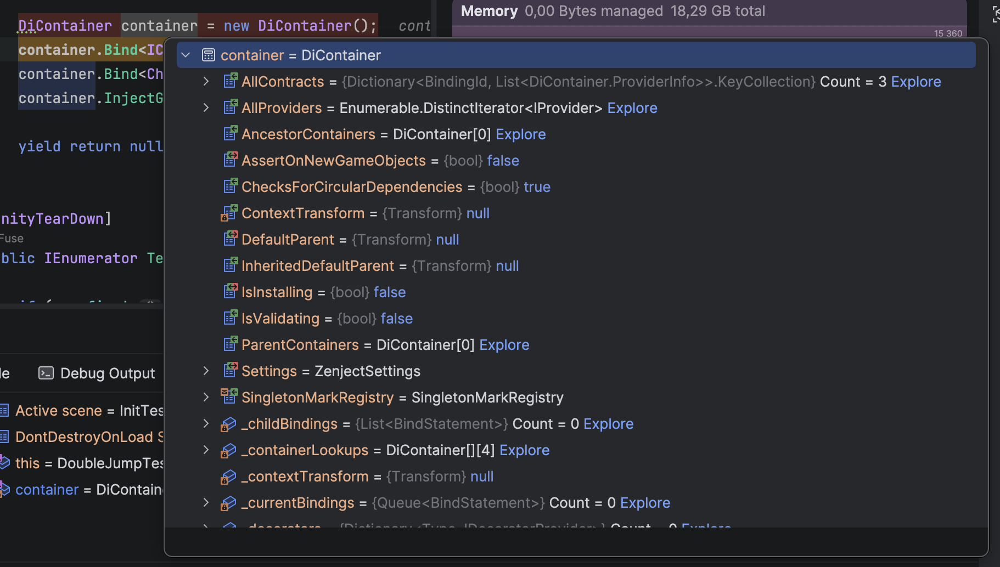

Возвращаемся к написанию теста.

Мы уже посмотрели на сетап-метод с соответствующим атрибутом. Тут мы руководствуемся правилом, про которое я писал выше: если нам не нужен yield-синтаксис, используем атрибуты из библиотеки NUnit.

```c#
[SetUp]  
public void SetUp()  
{  
    _config = ScriptableObject.CreateInstance<CharacterConfig>();  
    _input = new CharacterInputFake();  
  
    DiContainer container = new DiContainer();  
        container.Bind<ICharacterInput>().FromInstance(_input);  
    container.BindInstance(_config);  
  
    _ground = CreateGround();  
    _player = CreatePlayer();  
    _body = _player.GetComponent<Rigidbody2D>();  
  
    container.InstantiateComponent<PlayerCharacterController>(_player);  
    _player.SetActive(true);  
}
```


Немного про классы, которые представлены выше:
- `CharacterConfig` — обычный SO, в котором прописаны значения соответствующих параметров перемещения персонажа, в том числе скорость его прыжка, окно между повторными нажатиями кнопок A/D для рывка, коэффициент замедления при приседании и так далее;
- `CharacterInputFake` — созданный тут же мок-модуль для имитации работы реального контроллера ввода. Реализует интерфейс `ICharacterInput`, в котором не так уж много членов.

```c#
public interface ICharacterInput  
{  
    event Action JumpPressed;  
    event Action<int> DashRequested;  
    event Action<bool> CrouchChanged;  
  
    float Horizontal { get; }  
    bool CrouchHeld { get; }  
  
    void Initialize();  
}
```

- `CreateGround` — создаёт поверхность с коллайдером, на которой появляется персонаж.

```c#
private static GameObject CreateGround()  
{  
    GameObject ground = new GameObject("Test Ground");  
    ground.transform.position = new Vector2(0f, -0.5f);  
    ground.AddComponent<BoxCollider2D>().size = new Vector2(10f, 1f);  
    return ground;  
}
```

- `CreatePlayer` — создаёт тестовый GO персонажа с Rigidbody и капсульным коллайдером.

```c#
private static GameObject CreatePlayer()  
{  
    GameObject player = new GameObject("Test Player");  
    player.transform.position = new Vector2(0f, SpawnY);  
    player.SetActive(false);  
  
    Rigidbody2D body = player.AddComponent<Rigidbody2D>();  
    body.gravityScale = 0f;  
    body.freezeRotation = true;  
  
    CapsuleCollider2D collider = player.AddComponent<CapsuleCollider2D>();  
    collider.size = new Vector2(1f, 2f);  
  
    return player;  
}
```

- `PlayerCharacterController` — контроллер персонажа, который непосредственно двигает GO на сцене;
- коллайдер игрового объекта персонажа.

Первый тест из общего сета будет касаться прыжка, а именно проверки того, что наш прыжок работает и персонаж действительно получает заданную в конфиге скорость по оси Y.

```c#
[UnityTest]  
public IEnumerator OneJump_AppliesConfiguredJumpVelocity()  
{  
    yield return PressJump();  
  
    AssertJumpVelocity();  
}
```

`PressJump` имитирует нажатие пробела в нашем мок-контроллере ввода.

```c#
private IEnumerator PressJump()  
{  
    _input.PressJump();  
    yield return new WaitForFixedUpdate();  
}
```

В самом контроллере ввода просто вызывается соответствующее событие.

```c#
public void PressJump()  
{  
    JumpPressed?.Invoke();  
}
```

Теперь настало время поговорить о том, как в коде задать условие, при выполнении которого тест будет считаться успешно пройденным, а при невыполнении — соответственно, проваленным.

```c#
private void AssertJumpVelocity()  
{  
    Assert.That(  
        _body.linearVelocity.y,  
        Is.EqualTo(_config.JumpVelocity).Within(0.001f));  
}
```

Знакомьтесь: класс `Assert` из библиотеки NUnit. Именно его API будет определять итоговый статус теста. Этот тип — один из ключевых во всей библиотеке, а его главная задача — проверять истинность переданного условия. Если вам интересно прочитать полную документацию по этому типу, то вот она: https://docs.nunit.org/articles/nunit/writing-tests/assertions/assertions.html?q=Assert.

Если вкратце, в версиях NUnit 3.0+ практически все проверки записываются с использованием метода `That()` и так называемой Constraint Model. К примеру:

```csharp
Assert.That(myString, Is.EqualTo("Hello"));
```

Первым аргументом передаётся значение, а вторым — специальный синтаксис, который под капотом создаёт Constraint, то есть класс, непосредственно выполняющий проверку условия. В примере выше будет создан `Equal Constraint`. Суть в том, чтобы заключить логику проверки в одном конкретном классе, передаваемом в качестве второго параметра. Полный список ограничений: https://docs.nunit.org/articles/nunit/writing-tests/constraints/Constraints.html

В более старых версиях библиотеки проверки осуществлялись через специальные методы. То есть для каждого типа проверки был отдельный метод (например, `Assert.AreEqual`).

>Не путайте класс `Assert` из библиотеки NUnit и `Assert` из пространства имён `UnityEngine.Assertions`. Оба используют концепцию проверки: мы передаём утверждение в метод класса Assert, который под капотом определяет, истинно ли оно. Если условие оказывается ложным, метод не возвращает управление, а логирует ошибку. Если же в Assert передать несколько условий, метод вернёт управление только в том случае, если все они окажутся истинными (это очень похоже на логику работы сетов юнит-тестов).

Итак, мы разобрались, что делает `Assert.That()`. Посмотрим на код проверки из нашего теста ещё раз.

```c#
Assert.That(  
        _body.linearVelocity.y,  
        Is.EqualTo(_config.JumpVelocity).Within(0.001f));  
```

Как вы уже догадались, мы просто проверяем, равна ли скорость Rigidbody значению из конфига с погрешностью в 0.001.

Давайте попробуем запустить наш первый тест.

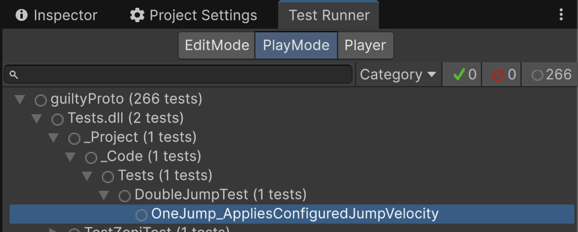

Теперь мы можем увидеть его в окне Test Runner, в соответствующей DLL. Для запуска конкретного теста или папки с тестами достаточно дважды кликнуть по нужному объекту в иерархии. Чтобы запустить все тесты в проекте, можно нажать `Run All` в правом нижнем углу.

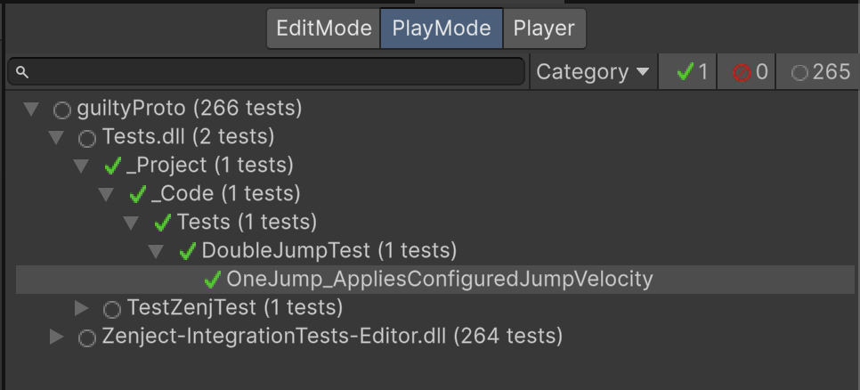

Тест прошёл проверку.

Для наглядности вот конфиг персонажа. Как видим, скорость прыжка равна 10, а значит, и в тестах персонаж получил аналогичную или близкую к ней скорость с погрешностью в 0.001.

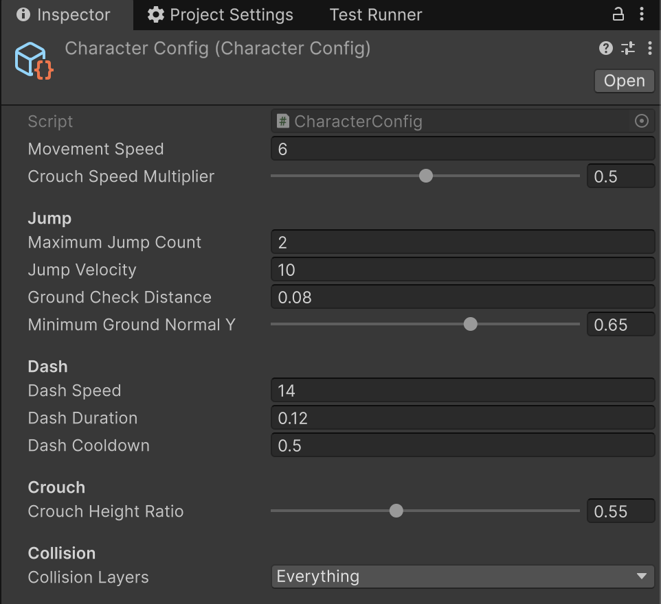


Теперь напишем тест для проверки двойного прыжка.

```c#
[UnityTest]  
public IEnumerator DoubleJump_AppliesSecondAirborneJumpVelocity()  
{  
    yield return PressJump();  
  
    AssertJumpVelocity();  
  
    _ground.SetActive(false);  
    _body.linearVelocity = new Vector2(0f, FallingVelocityBeforeSecondJump);  
  
    yield return PressJump();  
  
    AssertJumpVelocity();  
}
```

Здесь, аналогично прошлому тесту, после проверки первого прыжка мы отключаем землю под персонажем и имитируем второй прыжок, также проверяя, соответствует ли velocity по Y заданному в конфиге значению.

Следующим в сете будет тест возможности приседания. Логично предположить, что хорошей проверкой для данной фичи станет прохождение какого-нибудь препятствия в тот момент, когда персонаж находится в режиме приседания.

```c#
[UnityTest]  
public IEnumerator Crouch_FitsUnderObstacleAndCannotStandIntoIt()  
{  
    float standingHeight = _collider.size.y;  
    float crouchedHeight = standingHeight * _config.CrouchHeightRatio;  
    
    _ceiling = CreateLowCeiling(standingHeight, crouchedHeight);  
    Collider2D ceilingCollider = _ceiling.GetComponent<Collider2D>();  
  
    _input.SetCrouchHeld(true);  
    yield return new WaitForFixedUpdate();  
  
    Assert.That(  
        _collider.size.y,  
        Is.EqualTo(crouchedHeight).Within(0.001f));  
        
    Assert.That(  
        Physics2D.Distance(_collider, ceilingCollider).isOverlapped,  
        Is.False,  
        "The crouched collider should fit below the obstacle.");  
  
    _input.SetCrouchHeld(false);  
    yield return new WaitForFixedUpdate();  
  
    Assert.That(  
        _collider.size.y,  
        Is.EqualTo(crouchedHeight).Within(0.001f),  
        "The controller should remain crouched while standing is obstructed.");  
}
```

Разберём код выше по порядку:
- получаем высоту коллайдера в приседе и в положении стоя;
- `CreateLowCeiling`:
```c#
private GameObject CreateLowCeiling(  
    float standingHeight,  
    float crouchedHeight)  
{  
    float removedHeight = standingHeight - crouchedHeight;  
    
    float standingTop =  
        _player.transform.position.y +  
        _collider.offset.y +  
        standingHeight * 0.5f; 
         
    float ceilingHeight = removedHeight * 0.5f;  
  
    GameObject ceiling = new GameObject("Test Low Ceiling");
      
    ceiling.transform.position = new Vector2(  
        _player.transform.position.x,  
        standingTop - removedHeight * 0.5f);  
    ceiling.AddComponent<BoxCollider2D>().size = new Vector2(  
        2f,  
        ceilingHeight);    
        
        return ceiling;  
}
```

Этот метод рассчитывает высоту создаваемого препятствия (в нашем случае мы создаём потолок) и помещает его над персонажем, но пройти под ним можно, только находясь в приседе.

Само приседание меняет размер коллайдера и множитель скорости движения. Дальнейший вызов `_input.SetCrouchHeld(true)` в тесте вызывает соответствующее событие и обработчик в контроллере персонажа.

```c#
private void SetCrouched(bool crouched)  
{  
    if (_isCrouched == crouched)  
    {        return;  
    }  
    _isCrouched = crouched;  
  
    if (!crouched)  
    {        _collider.size = _standingColliderSize;  
        _collider.offset = _standingColliderOffset;  
        return;  
    }  
    float crouchedHeight =  
        _standingColliderSize.y * _config.CrouchHeightRatio;  
    float removedHeight = _standingColliderSize.y - crouchedHeight;  
  
    _collider.size = new Vector2(  
        _standingColliderSize.x,  
        crouchedHeight);    _collider.offset =  
        _standingColliderOffset +  
        Vector2.down * (removedHeight * 0.5f);  
}
```

Тут же в контроллере мы проверяем флаг и, если персонаж находится в приседе, изменяем его горизонтальную скорость.

```c#
float speedMultiplier = _isCrouched  
    ? _config.CrouchSpeedMultiplier  
    : 1f;  
  
horizontalVelocity =  
    _input.Horizontal *  
    _config.MovementSpeed *  
    speedMultiplier;
```

Далее в тесте идут две проверки:

```c#
Assert.That(  
        _collider.size.y,  
        Is.EqualTo(crouchedHeight).Within(0.001f));  
        
    Assert.That(  
        Physics2D.Distance(_collider, ceilingCollider).isOverlapped,  
        Is.False,  
        "The crouched collider should fit below the obstacle.");  
```

Первая — уже знакомая вам `Is.EqualTo()`. Она с погрешностью в 0.001 проверяет, равна ли высота коллайдера результату умножения его начальной высоты на значение `CrouchHeightRatio` из конфига. Это коэффициент уменьшения коллайдера при приседании: если в нашем конфиге он равен 0.55, то коллайдер станет почти вдвое ниже.

`Is.False` создаёт False Constraint, который проверяет, является ли переданное выражение ложным. Если выражение истинно, метод логирует ошибку с сообщением, переданным последним параметром. В данном случае через `Physics2D.Distance` мы проверяем, что коллайдер персонажа и коллайдер потолка не пересекаются (то есть `isOverlapped` имеет значение false).

```c#
public bool isOverlapped => (double) this.m_Distance < 0.0;
```

Так мы получаем поле в `ColliderDistance2D`. Если это значение равно нулю, коллайдеры соприкасаются друг с другом внешними границами, а отрицательное значение, соответственно, показывает, что они пересекаются.

Также к тесту можно добавить логику, проверяющую, что, если над персонажем есть препятствие, он останется в приседе. Для этого достаточно передать в контроллер ввода флаг false и проверить высоту коллайдера игрока. Она должна остаться равной произведению его обычной высоты и коэффициента из конфига.

```c#
_input.SetCrouchHeld(false);  
    yield return new WaitForFixedUpdate();  
  
    Assert.That(  
        _collider.size.y,  
        Is.EqualTo(crouchedHeight).Within(0.001f),  
        "The controller should remain crouched while standing is obstructed."); 
```

После написания этот тест также можно увидеть в окне Test Runner.

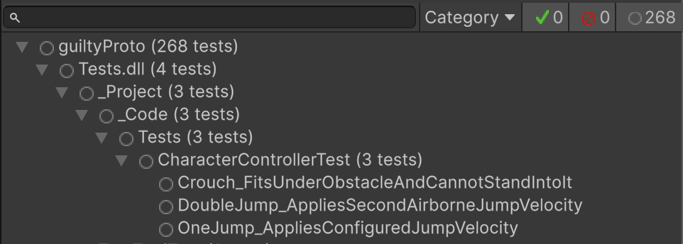

Попробуем его запустить.

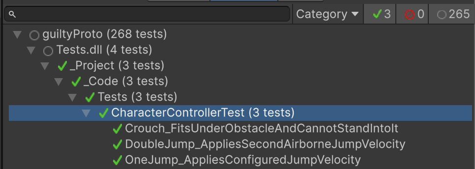

Все тесты завершились успешно.

Остался заключительный тест для сета — проверка дэша.

```c#
[UnityTest]  
public IEnumerator Dash_CanRepeatOnlyAfterCooldown()  
{  
    _input.RequestDash(1);  
    yield return new WaitForFixedUpdate();  
  
    AssertHorizontalVelocity(_config.DashSpeed);  
    float firstDashStartedAt = Time.fixedTime;  
  
    while (Time.fixedTime < firstDashStartedAt + _config.DashDuration)  
    {        
      yield return new WaitForFixedUpdate();  
    }  
    AssertHorizontalVelocity(0f);  
    Assert.That(  
        Time.fixedTime,  
        Is.LessThan(firstDashStartedAt + _config.DashCooldown),  
        "The test requires the dash duration to be shorter than its cooldown.");  
  
    _input.RequestDash(-1);  
    yield return new WaitForFixedUpdate();  
  
    AssertHorizontalVelocity(0f);  
  
    while (Time.fixedTime < firstDashStartedAt + _config.DashCooldown)  
    {        
      yield return new WaitForFixedUpdate();  
    }  
    
    _input.RequestDash(-1);  
    yield return new WaitForFixedUpdate();  
  
    AssertHorizontalVelocity(-_config.DashSpeed);  
}
```

В `_input.RequestDash(1)` мы передаём направление, в котором должен совершаться дэш: -1 — влево, 1 — вправо, а при 0 мы просто пропускаем метод. `RequestDash` вызывает соответствующий метод, а в контроллере персонажа мы используем вот такой обработчик:

```c#
  
private void TryStartDash()  
{  
    if (_queuedDashDirection == 0)  
    {   
    return;  
    }  
    
    int requestedDirection = _queuedDashDirection;  
    _queuedDashDirection = 0;  
  
    if (Time.fixedTime < _nextDashTime)  
    {        
      return;  
    }  
    _activeDashDirection = requestedDirection;  
    _dashEndTime = Time.fixedTime + _config.DashDuration;  
    _nextDashTime = Time.fixedTime + _config.DashCooldown;  
}
```

В контроллере также рассчитывается время, когда игрок сможет в следующий раз выполнить дэш. Для этого используется глобальное время с момента запуска, доступное в FixedUpdate монобеха через `Time.fixedTime`.

Проверку горизонтальной скорости персонажа я вынес в отдельный метод:

```c# 
private void AssertHorizontalVelocity(float expectedVelocity)  
{  
    Assert.That(  
        _body.linearVelocity.x,  
        Is.EqualTo(expectedVelocity).Within(0.001f));  
}
```

Далее ждём, пока закончится дэш, и проверяем, что скорость персонажа равна нулю, то есть он полностью остановился.

```c#
AssertHorizontalVelocity(0f);
```

Следующая проверка с использованием Assert:

```c#
Assert.That(  
    Time.fixedTime,  
    Is.LessThan(firstDashStartedAt + _config.DashCooldown),  
    "The test requires the dash duration to be shorter than its cooldown.");
    
  
_input.RequestDash(-1);  
yield return new WaitForFixedUpdate();  
  
AssertHorizontalVelocity(0f);
```

Он создаёт `LessThan Constraint`, который проверяет, меньше ли значение первого аргумента значения второго. В данном случае мы проверяем, что дэш не может сработать, пока не закончился кулдаун после предыдущего дэша. Сначала проверяем время, а затем пробуем вызвать дэш в другую сторону и сразу же через `AssertHorizontalVelocity(0f);` убеждаемся, что персонаж не двигался.

В конце ждём, пока пройдёт кулдаун, и ещё раз вызываем дэш влево, проверяя, что горизонтальная скорость соответствует заданной в конфиге.

```c#
while (Time.fixedTime < firstDashStartedAt + _config.DashCooldown)  
{  
    yield return new WaitForFixedUpdate();  
}  
  
_input.RequestDash(-1);  
yield return new WaitForFixedUpdate();  
  
AssertHorizontalVelocity(-_config.DashSpeed);
```

Вот и всё. Теперь у нас есть сет тестов, отвечающих за специальные возможности перемещения персонажа.

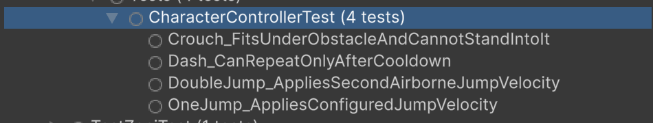

Сет можно считать успешно пройденным.

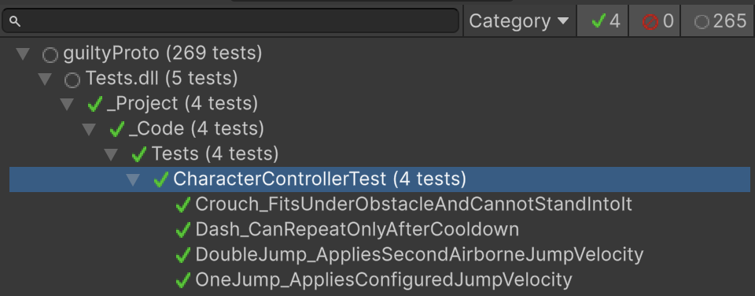

# Заключение

Надеюсь, мне удалось показать вам процесс тестирования с разных сторон. Несмотря на то что это действительно полезный инструмент, способный сэкономить вам кучу времени, он также требует ресурсов на поддержку и отладку. Не думайте о нём как о чём-то обязательном в каждом новом проекте, если только вы не планируете разработку по методологии TDD.

В этом материале я просто хотел показать основы работы при написании юнит-тестов и закрепить — в первую очередь для себя — пройденный материал. Если вы планируете изучать эту тему глубже, то лучшее, что я могу вам посоветовать, — это документация Unity: https://docs.unity3d.com/Packages/com.unity.test-framework@2.0/manual/index.html (не забудьте выбрать актуальную версию) и документация NUnit: https://docs.nunit.org/.
